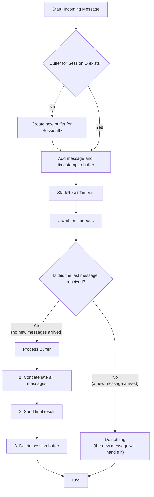

# Tired of needless complexity?

-   **Of following endless tutorials that build castles in the air with dozens of nodes?**
-   **Of setting up buffers with Redis or databases for something that only lives for a few seconds?**
-   **Of "smoke sellers"?**

`gblabs-n8n-buffer` is your solution. A simple, powerful, and straightforward buffer for chat systems in n8n.

## The truth about "No-Code" tools

n8n is a wonderful platform, no doubt. It gives us incredible agility. But let's be honest: like any tool, it has its limits. The lack of object-oriented features or true parallelism reminds us of something important.

True power doesn't just come from dragging and dropping nodes, but from **understanding the fundamentals**. The promise that "you no longer need to know how to program" is the most common spell cast by the smoke sellers of our time. Many of the "solutions" you'll see out there, for example, simply discard messages when two conversations clash—a "detail" they conveniently omit.

This node is a small manifesto. Proof that with a bit of old-school code and logic, we can overcome native limitations to build more efficient and elegant solutions.

## Knowing how to program is still an indispensable skill. Don't be fooled.


<div align="center">
  <em>⚠️ DANGER ⚠️</em>
</div>

## How does it work? Simplicity is power.

Instead of setting up a complex infrastructure, we rely on one of the most basic and powerful capabilities: **RAM.**

1.  **Global Variables**: We use a simple global variable in n8n to hold the message queue.
2.  **RAM Buffer**: Each new message from a session is stored in an in-memory array. Fast, direct, with no network or disk latency.
3.  **Smart Timeout**: The buffer waits for a few seconds (configurable). If a new message arrives, the timer resets. If time passes with no activity, it's done!
4.  **Concatenation & Sending**: All messages in the buffer are joined into a single text and sent to the next node.
5.  **Ephemeral Disappearance**: Once processed, the session's buffer is cleared from RAM. It doesn't need persistence because its purpose is temporary; it only lives for a few seconds.

It's that simple. No databases, no complex configurations, no external dependencies.

## Flowchart



## Installation

```bash
npm install n8n-nodes-gbplabs-chat-buffer
```
Then, restart your n8n instance.

## Usage

Look for the `Chat Buffer` node and add it to your workflow. Configure the parameters:

-   **Session ID**: The unique identifier for the conversation (e.g., `{{ $json.jid }}`).
-   **Message**: The content of the message to be buffered (e.g., `{{ $json.textMessageContent }}`).
-   **Timeout (ms)**: How many milliseconds to wait (default: `3000`).
-   **Separator**: The text that will join the messages (default: `. `).

---

Developed with ❤️ and a bit of rebellion by:

**Pablo Luis Sánchez Stahlschmidt**  
*gbplabs@gmail.com*  
*From the new land of freedom 🇦🇷* 