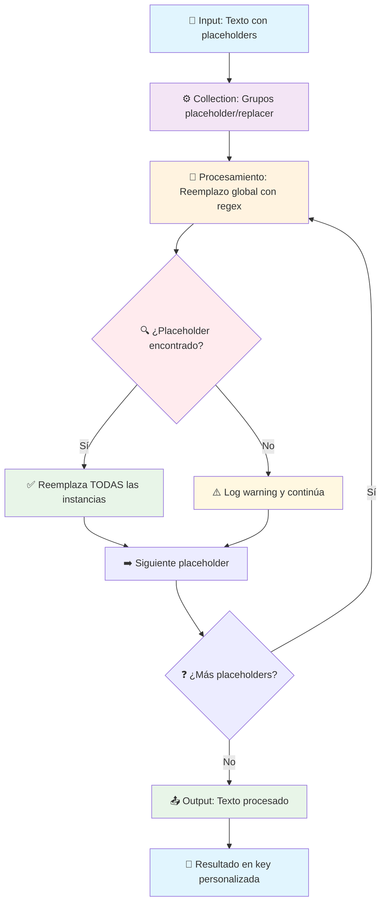

<div align="right">
  Leia em outros idiomas: 
  <a title="Inglês" href="./README.en.md">🇬🇧</a>
  <a title="Português" href="./README.pt.md">🇧🇷</a>
</div>

# ¿Cansado de la complejidad innecesaria?

- **¿De seguir tutoriales interminables que construyen workflows monstruosos para algo tan simple como reemplazar texto?**
- **¿De usar expresiones n8n anidadas que parecen jeroglíficos egipcios para hacer un simple find & replace?**
- **¿De los "vendedores de humo" que te venden "soluciones mágicas" con 15 nodos para lo que debería ser UNO?**

`n8n-nodes-text-replacer` es tu solución. Un nodo simple, potente y directo para reemplazar múltiples placeholders en texto.

## La verdad sobre las herramientas "No-Code"

n8n es una plataforma maravillosa, sin duda. Nos da una agilidad increíble. Pero seamos honestos: como toda herramienta, tiene sus límites. Ver workflows con 20 nodos haciendo Set, Function, y Code solo para reemplazar `{{nombre}}` por "Pablo" es... bueno, es triste.

El verdadero poder no viene solo de arrastrar y soltar nodos, sino de **entender los fundamentos**. La promesa de que "ya no necesitas saber programar" es el hechizo más común de los vendedores de humo de nuestra era. Muchas de las "soluciones" que verás por ahí, por ejemplo, simplemente ignoran casos edge como placeholders no encontrados o reemplazos múltiples, un "detalle" que convenientemente omiten.

Este nodo es un pequeño manifiesto. Una prueba de que, con un poco de código y lógica de la vieja escuela, podemos superar las limitaciones nativas para construir soluciones más eficientes y elegantes.

## Saber programar sigue siendo una habilidad indispensable. No te dejes engañar.


<div align="center">
  <em>⚠️ DANGER ⚠️</em>
</div>

## ¿Cómo funciona? La simpleza es poder.

En lugar de montar workflows complejos con múltiples nodos Set y Function, nos apoyamos en una de las capacidades más básicas y potentes: **el procesamiento de texto inteligente.**

1. **Input Configurable**: Define tu texto con placeholders como `$$nombre$$`, `$$fecha$$`, etc.
2. **Collection Dinámica**: Agrega tantos grupos placeholder/replacer como necesites con el botón "+"
3. **Reemplazo Global**: Cada placeholder se reemplaza en TODAS sus instancias en el texto
4. **Expresiones n8n**: Los replacers soportan expresiones dinámicas como `{{ $json.userName }}`
5. **Output Personalizable**: Define el nombre de la propiedad de salida que más te convenga
6. **Manejo de Errores**: Validaciones completas para casos edge que otros "olvidan"

Es así de simple. Sin workflows gigantes, sin configuraciones complejas, sin dependencias externas.

## Diagrama de Flujo



## Ejemplos de Uso

### Ejemplo Básico
```
Input: "Hola $$nombre$$, tu edad es $$edad$$ años"
Replacements:
- $$nombre$$ → Pablo
- $$edad$$ → 30
Output: "Hola Pablo, tu edad es 30 años"
```

### Con Expresiones n8n
```
Input: "Bienvenido $$usuario$$, tu último login fue $$fecha$$"
Replacements:
- $$usuario$$ → {{ $json.userName }}
- $$fecha$$ → {{ $json.lastLogin }}
Output: "Bienvenido Pablo, tu último login fue 2024-01-15"
```

### Múltiples Instancias
```
Input: "$$saludo$$ $$nombre$$, esperamos que $$nombre$$ tenga un buen día. $$saludo$$!"
Replacements:
- $$saludo$$ → Hola
- $$nombre$$ → María
Output: "Hola María, esperamos que María tenga un buen día. Hola!"
```

## Instalación

### Desde npm (Recomendado)
```bash
npm install n8n-nodes-text-replacer
```

### Desarrollo Local
```bash
./install.sh
```

O manualmente:
```bash
npm install
npm run build
npm pack
# Instalar el paquete .tgz generado en tu instancia n8n
```

Luego, reinicia tu instancia de n8n.

## Uso

Busca el nodo `Text Replacer` en la categoría Transform y agrégalo a tu workflow. Configura los parámetros:

- **Input Text**: El texto con placeholders a reemplazar (soporta expresiones n8n)
- **Output Key Name**: Nombre de la propiedad de salida (default: `processedText`)
- **Replacements**: Collection dinámica de grupos placeholder/replacer
  - **Placeholder**: El texto a buscar (ej: `$$nombre$$`)
  - **Replacer**: El valor de reemplazo (soporta expresiones n8n)

## Características

✅ **Múltiples Replacements**: Botón "+" para agregar tantos como necesites  
✅ **Expresiones n8n**: Soporte completo para `{{ $json.field }}`  
✅ **Output Key Personalizable**: Define el nombre de la propiedad de salida  
✅ **Reemplazo Global**: Reemplaza TODAS las instancias del placeholder  
✅ **Logging Detallado**: Logs extensivos para debugging  
✅ **Manejo de Errores**: Continúa en caso de error si está configurado  
✅ **Validaciones**: Maneja casos edge como placeholders vacíos o no encontrados  

---

Desarrollado con ❤️ y un poco de rebeldía por:

**Pablo Luis Sánchez Stahlschmidt**  
*gbplabs@gmail.com*  
*Desde la nueva tierra de la libertad 🇦🇷*

Y con la invaluable colaboración del gran:

**Federico Pereira**  
*lordbasex@gmail.com*  
*Y sí, también desde la nueva tierra de la libertad 🇦🇷*

