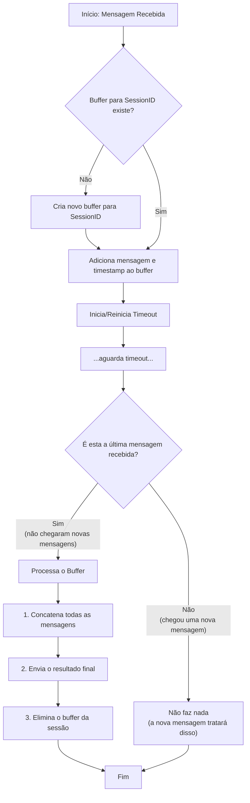

# Cansado da complexidade desnecessária?

-   **De seguir tutoriais intermináveis que constroem castelos no ar com dezenas de nós?**
-   **De montar buffers com Redis ou bases de dados para algo que só vive por alguns segundos?**
-   **Dos "vendedores de fumaça"?**

`gblabs-n8n-buffer` é a sua solução. Um buffer simples, potente e direto para sistemas de chat no n8n.

## A verdade sobre as ferramentas "No-Code"

O n8n é uma plataforma maravilhosa, sem dúvida. Dá-nos uma agilidade incrível. Mas sejamos honestos: como toda ferramenta, tem os seus limites. A falta de orientação a objetos ou de um paralelismo real lembra-nos de algo importante.

O verdadeiro poder não vem apenas de arrastar e soltar nós, mas de **entender os fundamentos**. A promessa de que "você já não precisa saber programar" é o feitiço mais comum dos vendedores de fumaça da nossa era. Muitas das "soluções" que você verá por aí, por exemplo, simplesmente descartam mensagens quando duas conversas colidem, um "detalhe" que convenientemente omitem.

Este nó é um pequeno manifesto. Uma prova de que, com um pouco de código e lógica da velha guarda, podemos superar as limitações nativas para construir soluções mais eficientes e elegantes.

## Saber programar continua a ser uma habilidade indispensável. Não se deixe enganar.


<div align="center">
  <em>⚠️ PERIGO ⚠️</em>
</div>

## Como funciona? A simplicidade é poder.

Em vez de montar uma infraestrutura complexa, apoiamo-nos numa das capacidades mais básicas e potentes: **a memória RAM.**

1.  **Variáveis Globais**: Usamos uma simples variável global no n8n para manter a fila de mensagens.
2.  **Buffer em RAM**: Cada nova mensagem de uma sessão é guardada num array em memória. Rápido, direto, sem latência de rede ou de disco.
3.  **Timeout Inteligente**: O buffer espera alguns segundos (configurável). Se chegar uma nova mensagem, o contador é reiniciado. Se o tempo passar sem atividade, pronto!
4.  **Concatenação e Envio**: Todas as mensagens no buffer são unidas num único texto и enviadas para o nó seguinte.
5.  **Desaparecimento Efêmero**: Uma vez processado, o buffer dessa sessão é limpo da RAM. Não precisa de persistência porque o seu propósito é temporal, vive apenas por alguns segundos.

É assim tão simples. Sem bases de dados, sem configurações complexas, sem dependências externas.

## Diagrama de Fluxo



## Instalação

```bash
npm install n8n-nodes-gbplabs-chat-buffer
```
Depois, reinicie a sua instância do n8n.

## Utilização

Procure o nó `Chat Buffer` e adicione-o ao seu workflow. Configure os parâmetros:

-   **Session ID**: O identificador único da conversa (ex: `{{ $json.jid }}`).
-   **Message**: O conteúdo da mensagem a "bufferear" (ex: `{{ $json.textMessageContent }}`).
-   **Timeout (ms)**: Quantos milissegundos esperar (padrão: `3000`).
-   **Separator**: O texto que unirá as mensagens (padrão: `. `).

---

Desenvolvido com ❤️ e um pouco de rebeldia por:

**Pablo Luis Sánchez Stahlschmidt**  
*gbplabs@gmail.com*  
*Da nova terra da liberdade 🇦🇷* 