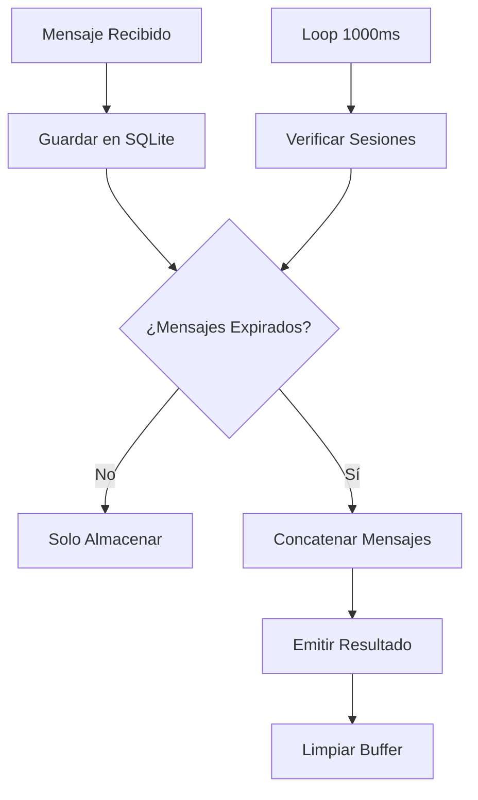

# n8n-nodes-chatbuffer


Un nodo personalizado de n8n para buffer temporal automático de mensajes de chat usando SQLite.

## ✨ Características

- **Buffer temporal automático**: Acumula mensajes y los emite concatenados después del timeout
- **Verificación continua**: Loop de verificación cada 1000ms para procesar mensajes expirados
- **Base de datos SQLite**: Almacenamiento persistente y eficiente
- **Configuración flexible**: Timeout y separador personalizables
- **Múltiples sesiones**: Manejo independiente de diferentes sesiones de chat
- **Sin dependencias externas**: SQLite incluido automáticamente

## 🚀 Instalación

### Nodos de Comunidad (Recomendado)

1. Ve a **Configuración > Nodos de Comunidad**
2. Selecciona **Instalar**
3. Ingresa `n8n-nodes-chatbuffer` en **Nombre del paquete npm**
4. Acepta los riesgos: selecciona **Entiendo los riesgos de instalar código no verificado**
5. Selecciona **Instalar**

### Instalación Manual

Para instalaciones de n8n auto-hospedadas:

```bash
npm install n8n-nodes-chatbuffer
```

Para despliegues basados en Docker:

```bash
RUN cd /usr/local/lib/node_modules/n8n && npm install n8n-nodes-chatbuffer
```

## 📖 Uso

### Parámetros de Entrada

| Parámetro   | Tipo   | Requerido | Por Defecto | Descripción                              |
| ----------- | ------ | --------- | ----------- | ---------------------------------------- |
| `sessionId` | string | ✅        | -           | ID único de la sesión de chat            |
| `message`   | string | ✅        | -           | Mensaje a agregar al buffer              |
| `timeout`   | number | ✅        | 3000        | Tiempo en ms antes de procesar el buffer |
| `separator` | string | ❌        | ". "        | Separador para concatenar mensajes       |

### Salida

El nodo **solo emite datos** cuando se cumple la condición de timeout:

```json
{
	"sessionId": "user123",
	"concatenatedMessage": "Hola. ¿Cómo estás?. Muy bien gracias"
}
```

### Ejemplo de Workflow

```
[Webhook] → [ChatBuffer] → [Procesar Mensaje Completo]
     ↓           ↓                    ↓
  Mensaje    Buffer hasta      Mensaje concatenado
  recibido   timeout          enviado automáticamente
```

## 🔧 Cómo Funciona

1. **Recepción**: Cada mensaje se almacena en SQLite con timestamp
2. **Verificación**: Loop global verifica cada 1000ms si hay mensajes expirados
3. **Timeout**: Si han pasado más de `timeout` ms desde el último mensaje
4. **Procesamiento**: Concatena todos los mensajes de la sesión
5. **Emisión**: Emite el mensaje concatenado y limpia el buffer

### Diagrama de Flujo



## 🎯 Casos de Uso

- **Chatbots**: Agrupar mensajes rápidos del usuario antes de procesar
- **Análisis de texto**: Acumular texto para análisis por lotes
- **Notificaciones**: Evitar spam agrupando notificaciones
- **APIs con límites**: Reducir llamadas agrupando datos

## 🛠️ Configuración Avanzada

### Variables de Entorno

El nodo utiliza la carpeta de n8n para almacenar la base de datos:

- Ruta por defecto: `~/.n8n/chatbuffer/messages.db`
- Variable: `N8N_USER_FOLDER` (opcional)

### Base de Datos

- **Motor**: SQLite 5.1.6
- **Tabla**: `message_buffer`
- **Campos**: id, session_id, message, timestamp, created_at
- **Índices**: Optimizado para consultas por sesión y timestamp

## 🔍 Troubleshooting

### Problema: "SQLITE_ERROR: no such table"

**Solución**: El nodo crea la tabla automáticamente. Reinicia n8n si persiste.

### Problema: Mensajes no se procesan

**Verificación**:

- Confirma que el timeout está configurado correctamente
- Revisa los logs de n8n para errores
- Verifica que SQLite tiene permisos de escritura

### Problema: Loop no funciona

**Causa**: El loop global se inicia con el primer mensaje. Si no hay actividad, no hay verificación.

## 📝 Desarrollo

### Estructura del Proyecto

```
nodes/ChatBuffer/
├── nodes/ChatBuffer/
│   ├── ChatBuffer.node.ts      # Nodo principal
│   └── chatbuffer.svg          # Icono
├── credentials/
│   └── ChatBufferCredentials.ts
├── package.json
├── tsconfig.json
└── README.md
```

### Compilar

```bash
npm run build
```

### Probar Localmente

```bash
npm pack
npm install -g ./n8n-nodes-chatbuffer-1.0.0.tgz
```

## 🤝 Contribuir

1. Fork el repositorio
2. Crea una rama: `git checkout -b feature/nueva-funcionalidad`
3. Commit: `git commit -am 'Agregar nueva funcionalidad'`
4. Push: `git push origin feature/nueva-funcionalidad`
5. Crea un Pull Request

## 📄 Licencia

MIT License - ver [LICENSE.md](LICENSE.md) para detalles.

## 🔗 Enlaces

- [n8n Documentation](https://docs.n8n.io/)
- [Community Nodes](https://docs.n8n.io/integrations/community-nodes/)
- [SQLite Documentation](https://www.sqlite.org/docs.html)

## 📧 Soporte

¿Problemas o preguntas?

- 🐛 [Reportar Bug](https://github.com/TU_USERNAME/n8n-nodes-chatbuffer/issues)
- 💡 [Solicitar Funcionalidad](https://github.com/TU_USERNAME/n8n-nodes-chatbuffer/issues)
- 💬 [Discusión](https://github.com/TU_USERNAME/n8n-nodes-chatbuffer/discussions)

---

⭐ **¡Si este nodo te resulta útil, considera darle una estrella en GitHub!**
